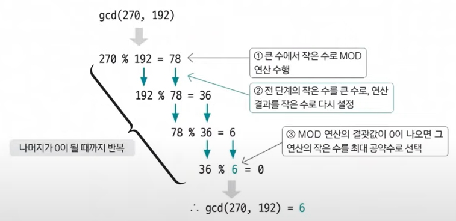

#### 📚 유클리드 호제법  
- 유클리드 호제법(euclidean-algorithm) : 두 수의 최대공약수를 구하는 알고리즘  

📌 유클리드 호제법의 핵심 이론  
- MOD 연산(두 값을 나눈 나머지를 구하는 연산)이 최대공약수를 구하는데 사용하는 핵심 연산!!  

  > 📜 MOD 연산으로 구현하는 유클리드 호제법  
  > - 큰 수를 작은 수로 나누는 MOD 연산을 수행함.
  > - 앞 단계에서의 작은 수와 MOD 연산 결괏값(나머지)으로 MOD 연산을 수행함.
  > - 단계 2️⃣를 반복하다가 나머지가 0이 되는 순간의 작은 수를 최대 공약수로 선택함.   
  >   
- 유클리드 호제법을 코딩으로 구현할 때는 **재귀함수**를 이용함!

