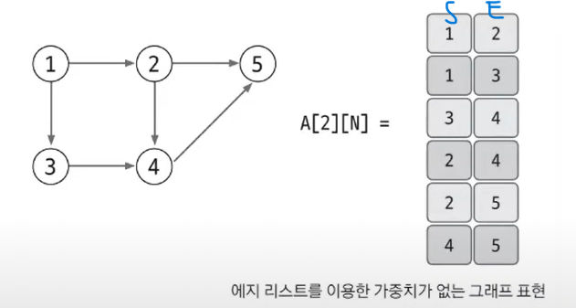
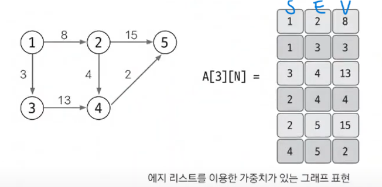
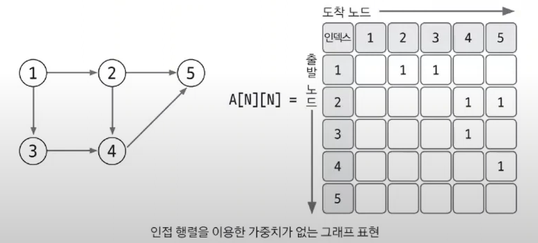
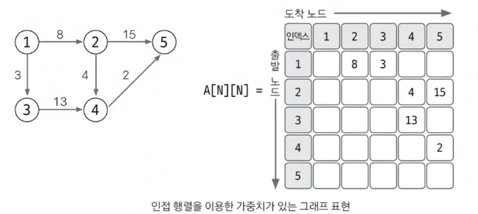
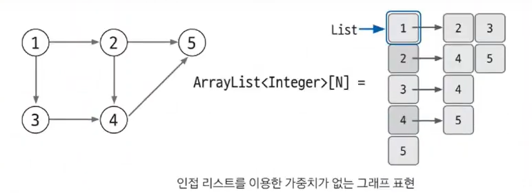
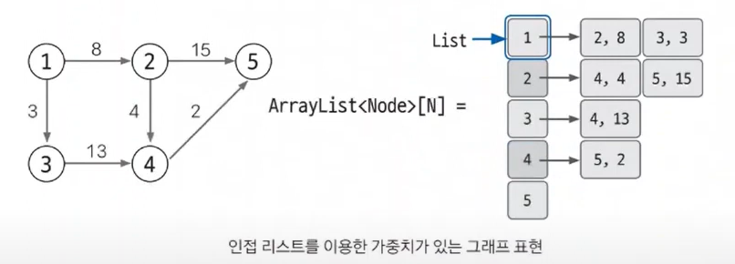

#### 📚 그래프  
- **그래프**는 노드와 에지로 구성된 집합  
  - 노드 : 데이터를 표현하는 집합
  - 에지 : 노드를 연결함  
- 유니온 파인드 : 그래프의 사이클이 생성되는지 판별하는 알고리즘
- 위상 정렬 : **방향이 있고 사이클이 없는** 노드와 에지를 갖는 그래프를 정렬하는 알고리즘  
ex) 수강신청, 게임 빌드오더
- 다익스트라 & 벨만-포드 & 플로이드-워셜  
  *👉 최단거리 알고리즘*  
  - 다익스트라 : **음수 간선 X**, 시작점이 있고 다른 모든 노드로 가는 최단거리를 구하는 알고리즘
  - 벨만-포드 : **음수 간선 O**, 시작점이 있고 다른 모든 노드로 가는 최단거리를 구하는 알고리즘  
  - 플로이드-워셜 : **시작점 X**, 모든 노드에 대해 최단거리를 구하는 알고리즘  
- 최소 신장 트리 : 그래프에서 최소의 가중치 합으로 모든 노드를 연결할 수 있게 해주는 알고리즘(사이클 있으면 안됨!)  
  - 유니온 파인드를 구현하여 사이클이 있지 않도록 해줌!  

#### 📚 그래프의 표현  
- **에지 리스트** : 에지를 중심으로 그래프를 표현  
  - 에지 리스트로 가중치 없는 그래프 표현  
     
      
  - 에지 리스트로 가중치 있는 그래프 표현  

      
  > 📌 에지 리스트는 벨만 포드 or 크루스칼(MST) 알고리즘에 사용되며, 노드 중심 알고리즘에는 잘 사용하지 않음!  

- **인접 행렬** : 2차원 배열을 자료구조로 이용하여 그래프를 표현  
  - 인접 행렬로 가중치 없는 그래프 표현  
    
      
    👉 1에서 2를 향하는 에지를 인접 행렬은 1행 2열에 1을 저장하는 방식으로 표현!  
    (1을 저장하는 이유는 가중치가 없기 때문)  
  - 인접 행렬로 가중치 있는 그래프 표현  

      
  > 📌 인접 행렬을 이용한 그래프 구현은 쉬움. 두 노드를 연결하는 에지의 여부와 가중치값은 배열에 직접 접근하여 바로 확인할 수 있는 것도 장점!  
  > - BUT, 노드와 관련되어 있는 에지를 탐색하려면 N번 접근해야 하므로 노드 개수에 비해 에지가 적을 때 공간 효율성 & 시간 복잡도 떨어짐.  

- **인접 리스트✨**  : ArrayList로 그래프를 표현  
   - 인접 리스트로 가중치 없는 그래프 표현  
    
        
   - 인접 리스트로 가중치 있는 그래프 표현✨  

        
      👉 가중치가 있는 경우 자료형을 **클래스**로 사용함. 위 그림에서는 (도착노드, 가중치)를 갖는 Node 클래스를 선언하여 ArrayList에 사용할 것!  
  > 📌 인접 리스트를 이용한 그래프 구현은 복잡한 편이지만, 노드와 연결되어 있는 에지를 탐색하는 시간은 매우 뛰어나며 노드 개수가 커도 공간 효율이 좋아 메모리 초과 에러도 발생하지 않음!
