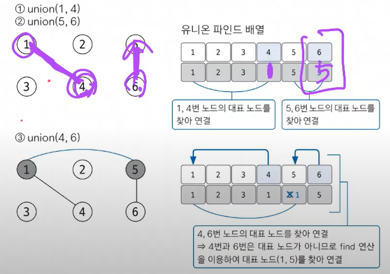
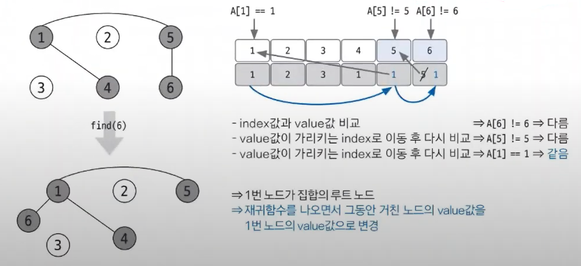
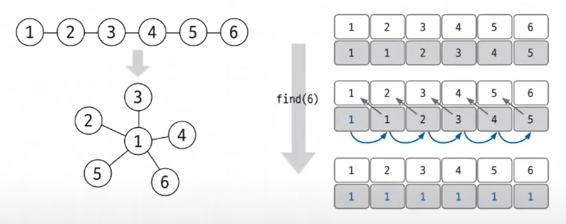

#### 📚 유니온 파인드  
- 유니온 파인드(union-find) : 일반적으로 여러 노드가 있을 때 특정 2개의 노드를 연결해 1개의 집합으로 묶는 **union 연산**과 두 노드가 같은 집합에 속해 있는지를 확인하는 **find 연산**으로 구성되어 있는 알고리즘  

    
- union 연산할 때 항상 대표노드끼리 연결해줌!
- find 연산은 자신이 속한 집합의 대표노드를 찾는 연산! 그래프를 정돈하고 시간 복잡도를 향상시키는 역할도 함.  
> 📌 find 연산의 작동 원리  
> 1. 대상 노드 배열에 index값과 value값이 동일한지 확인함.
> 2. 동일하지 않으면 value값이 가리키는 index 위치로 이동함.  
> 3. 이동 위치의 index값과 value값이 같을 때까지(대표노드 찾을 때까지) 1️⃣~2️⃣를 반복함. 반복이므로 이 부분은 재귀 함수로 구현.  
> 4. 대표 노드에 도달하면 재귀 함수를 빠져나오면서 거치는 모든 노드값을 루트 노드값(대표 노드의 value값)으로 변경함.  
>   

  
👉 한 번의 find 연산을 이용해 모든 노드가 루트 노드에 직접 연결되는 형태로 변경되었음.  
이러한 형태로 변경되면 이후 find 연산이 진행될 때 **경로 압축**의 효과가 나타남!!  
> ✨ 경로 압축 : 실제 그래프에서 여러 노드를 거쳐야 하는 경로에서 그래프를 변형해 더 짧은 경로로 갈 수 있도록 함으로써 시간 복잡도를 효과적으로 줄이는 방법