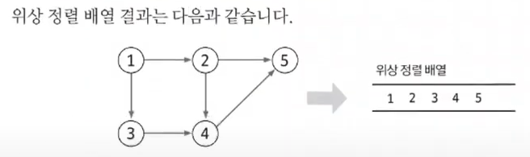

#### 📚 위상 정렬  
- 위상 정렬 : **사이클이 없는** 방향 그래프에서 노드 순서를 찾는 알고리즘  
- 시간복잡도(노드 수: V, 에지 수: E)  
  👉 O(V + E)  
- 위상 정렬에서는 항상 유일한 값으로 정렬되지 않음!  
  
📌 위상 정렬 동작 원리  
: 진입 차수 배열을 기준으로 정렬이 됨!  

  
  
▶ 이 과정을 모든 노드가 정렬될 때까지 반복!  

  
  
