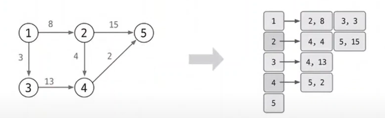
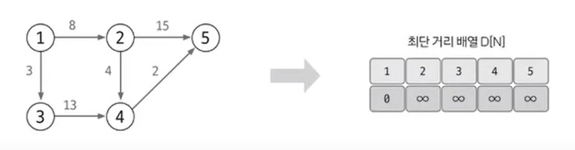
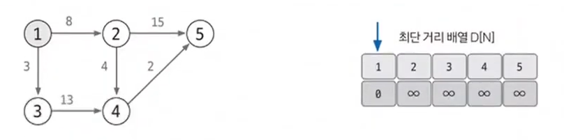
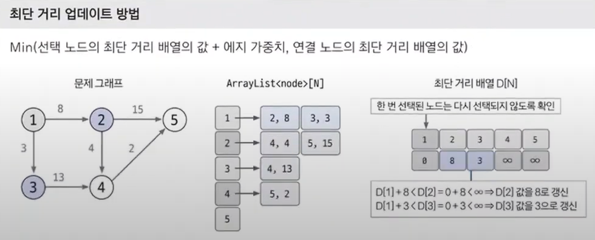
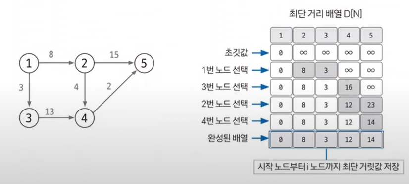

#### 📚 다익스트라  
- 다익스트라(dijkstra) 알고리즘 : 출발노드와 그외 노드 간의 최단 거리를 구하는 알고리즘  
  - 에지(노드 간 연결선)는 항상 양수여야 하는 제약조건이 있음.  

> 📌 다익스트라 알고리즘의 핵심 이론  
> 1. 인접 리스트로 그래프 구현하기 
>   
> 인접 리스트에 연결한 배열의 자료형은 (노드, 가중치) 와 같은 형태로 선언함.  
> 2. 최단 거리 배열 초기화하기  
> : 최단 거리 배열을 만들고, 출발 노드는 0, 이외의 노드는 무한(∞) 으로 초기화함.     
>   
> 3. 값이 가장 작은 노드 고르기  
> 
> 여기서는 값이 0인 출발노드에서 시작  
> 4. 최단 거리 배열 업데이트하기  
> : 선택된 노드에 연결된 에지의 값을 바탕으로 다른 노드의 값을 업데이트함.  
> 👉 1️⃣ 에서 저장해 놓은 연결 리스트를 이용해 현재 선택된 노드의 에지들을 탐색하고 업데이트하면 됨!  
>   
> 5. 3️⃣~4️⃣ 를 반복해 최단 거리 배열 완성하기  
> : 모든 노드가 처리될 때까지 3️⃣~4️⃣ 를 반복함.  
> 과정4️⃣ 에서 선택 노드가 될 때마다 다시 선택되지 않도록 방문 배열을 만들어 처리하고, 모든 노드가 선택될 때까지 반복하면 최단 거리 배열이 완성됨.  
>   
