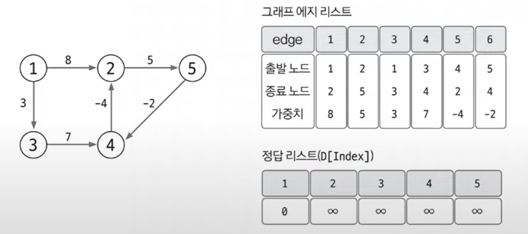
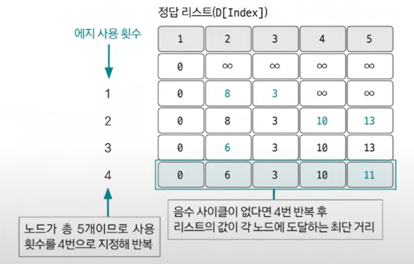
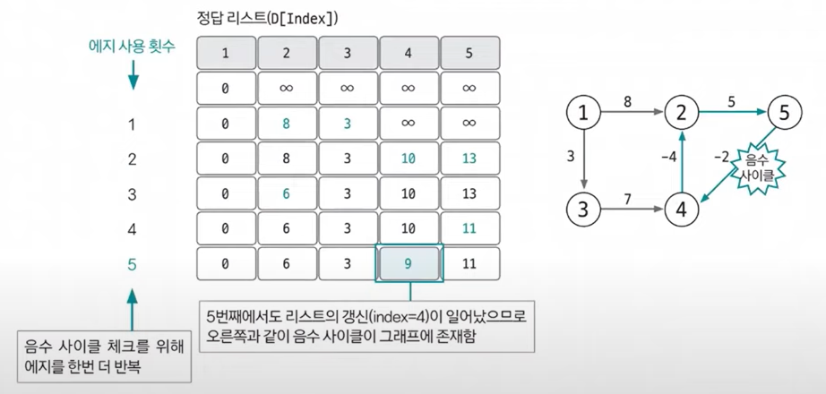

#### 📚 벨만 포드 (Bellman-Ford)  
- 특정 출발 노드에서 다른 모든 노드까지의 최단 경로 탐색 (다익스트라 알고리즘과 동일)  
  - **음수 가중치 에지**가 있어도 수행할 수 있음. (다익스트라 알고리즘과의 차이점)  
  - 전체 그래프에서 **음수 사이클의 존재 여부를 판단**할 수 있음. (다익스트라 알고리즘과의 차이점) 
  
📌 벨만 포드 알고리즘의 동작 원리  
1. 에지 리스트로 그래프를 구현하고 최단 경로 리스트 초기화하기  
- 벨만 포드 알고리즘은 에지를 중심으로 동작하므로 그래프를 **에지 리스트**로 구현함.  
- 최단 경로 리스트를 출발 노드는 0, 나머지 노드는 무한대로 초기화함.  
- 다음 예에서 출발 노드를 1로 선택해 벨만 포드 알고리즘을 진행  
  
2. 모든 에지를 확인해 정답 리스트 업데이트하기  
- 최단 거리 리스트에서 업데이트 반복 횟수 :  `노드개수 - 1`  
👉 노드 개수가 N이고, 음수 사이클이 없을 때 특정 두 노드의 최단 거리를 구성할 수 있는 에지의 최대 개수는 `N - 1` 이기 때문!
- 모든 에지 E = (s, e, w)에서 다음 조건을 만족하면 업데이트를 실행함  
- 업데이트 반복 횟수가 K번이라면 해당 시점에 정답 리스트의 값은 시작점에서 K개의 에지를 사용했을 때 각 노드에 대한 최단 거리임.
  > 💡 업데이트 조건과 방법  
  > D[s] != ∞ 이며 D[e] > D[s] + w 일 때 D[e] = D[s] + w 로 리스트 값을 업데이트 함.    
    
- 음수 사이클이 없을 때 `N - 1`번 에지 사용 횟수를 반복하면 출발 노드와 모든 노드 간의 최단 거리를 알려주는 정답 리스트가 완성됨. 이렇게 완성 후 마지막으로 이 그래프에 음수 사이클이 존재하는지 확인해야 함!  
3. 음수 사이클 유무 확인하기  
- 음수 사이클 유무를 확인하기 위해 모든 에지를 한 번씩 다시 사용해 업데이트되는 노드가 발생하는지 확인함.  
- 만약 업데이트 되는 노드가 있다면 음수 사이클이 있다는 뜻이 되고, 2단계에서 도출한 정답 리스트가 무의미하고 최단 거리를 찾을 수 없는 그래프라는 뜻이 됨.      
  
