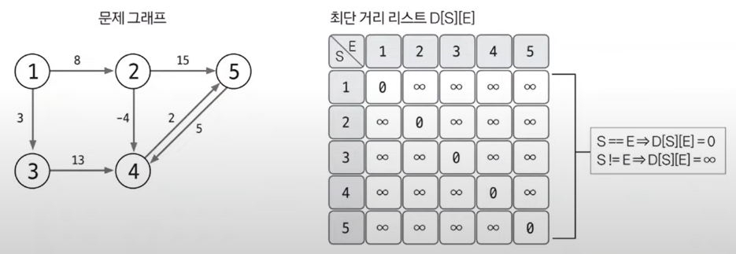

#### 📚 플로이드-워셜  
- 그래프에서 최단거리를 구하는 알고리즘  
  - **모든 노드 간**에 최단 경로 탐색
  - 음수 가중치 에지가 있어도 수행 가능 (단, 음수 사이클이 있으면 X!)
  - 동적 계획법의 원리를 이용해 알고리즘에 접근  

> 📌 플로이드-워셜의 핵심 이론  
> - A노드에서 B노드까지 최단 경로를 구했다고 가정했을 때 최단 경로 위에 K노드가 존재한다면 그것을 이루는 부분 경로 역시 최단 경로임.  
> 👉 전체 경로의 최단 경로는 부분 경로의 최단 경로의 조합으로 이뤄진다는 의미  
> 👉도출한 플로이드-워셜 점화식  
> D[S][E] = Math.min(D[S][E], D[S][K] + D[K][E])
  
✨ 플로이드-워셜 알고리즘 구현 방법  
1. 리스트를 선언하고 초기화하기  
- D[S][E] : 노드 S에서 노드 E까지의 최단 거리를 저장하는 리스트라 정의  
- S와 E의 값이 같은 칸은 0, 다른 칸은 ∞ 로 초기화함. S == E 는 자기 자신에게 가는데 걸리는 최단 경로값을 의미하기 때문!  
  
2. 최단 거리 리스트에 그래프 데이터 저장하기  
- 출발 노드는 S, 도착 노드는 E, 이 에지의 가중치는 W라고 했을 때 D[S][E] = W로 에지의 정보를 리스트에 입력함.  
👉 플로이드-워셜 알고리즘은 그래프를 인접 행렬로 표현함을 알 수 있음.  
  
3. 점화식으로 리스트 업데이트하기  
- 기존에 구했던 점화식을 3중 for 문의 형태로 반복하면서 리스트의 값을 업데이트함.(⭐)  
  
- 완성된 리스트는 모든 노드 간의 최단 거리를 알려줌.  
- 플로이드-워셜 알고리즘은 모든 노드 간의 최단 거리를 확인해 주기 때문에 시간 복잡도가 O(V³)으로 빠르지 않은 편임.  
👉 이에 따라 플로이드-워셜 알고리즘을 사용해야 하는 문제가 나오면 일반적으로 노드 개수의 범위가 다른 그래프에 비해 적게 나타나는 것을 알 수 있음!
  