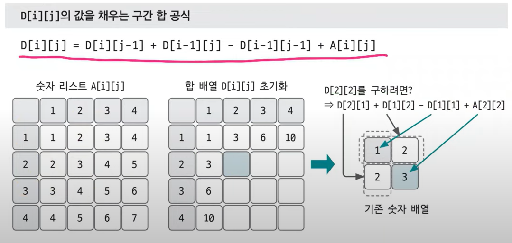
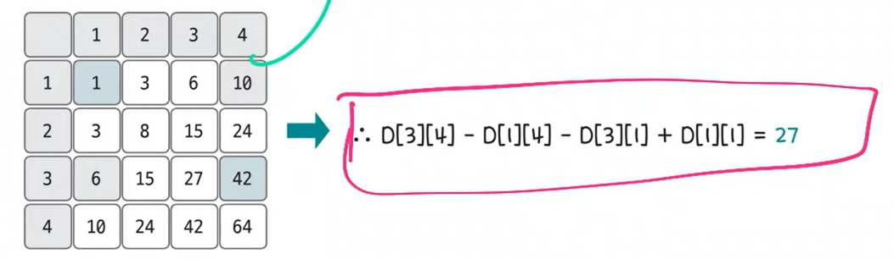
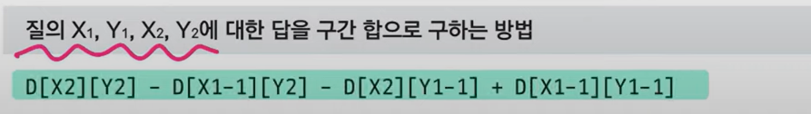
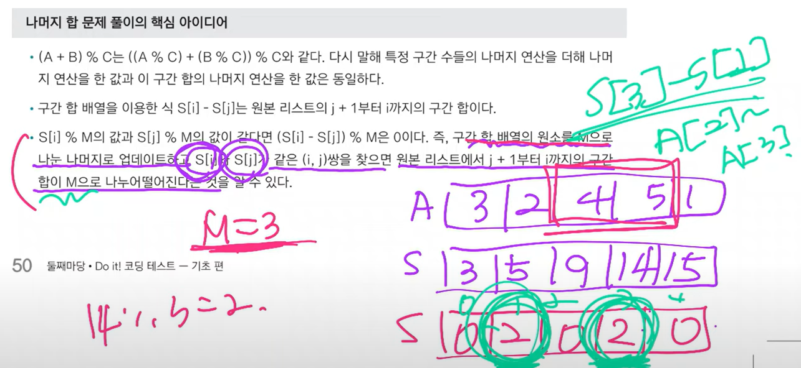

### 구간 합
- 구간 합 : 합 배열을 이용하여 시간 복잡도를 줄이기 위해 사용하는 특수한 목적의 알고리즘
  - 합 배열  
  
    ```python
    S[i] = A[0] + A[1] + ... + A[i-1] + A[i]  # A[0]부터 A[i]까지의 합
    ```
  - 합 배열 S를 만드는 공식  
    ```python
    S[i] = S[i-1] + A[i]
    ```
- 합 배열을 이용하여 i에서 j까지 구간 합을 구하는 공식  
    ```python
    S[j] - S[i-1]
    ```

- 2차원 구간 합 배열 D[X][Y] = 원본 배열의 (0, 0) 부터 (X, Y)까지의 사각형 영역 안에 있는 수의 합  
    ```
    D[1][j] = D[1][j-1] + A[1][j]
    ```
    
    
    

>✨참고 사이트
> - [파이썬 배열](https://wikidocs.net/223079)

- 나머지 합 문제의 핵심 아이디어
  
  