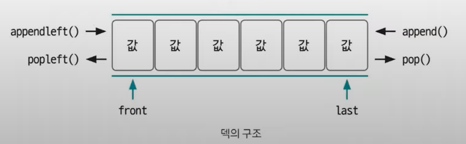

#### 📝최솟값 찾기 BOJ11003
- 일정 범위 안에서 최솟값을 구하는 문제이므로 슬라이딩 윈도우와 정렬을 사용하면 될 것 같다고 생각할 수 있음.
- 윈도우의 크기는 문제에서 최솟값을 구하는 범위가 i-L+1부터 i까지이므로 L로 생각하면 됨!
- 일반적으로 정렬은 O(nlogn)의 시간 복잡도를 가지므로 N과 L의 최대 범위가 5000000인 이 문제에서는 정렬을 사용할 수 없음.  
>👉 O(n)의 시간 복잡도로 해결해야 함!!
- 슬라이딩 윈도우를 덱(deque)으로 구현하여 정렬 효과를 볼 수 있음

    
- 덱 : 양 끝에서 데이터를 삽입하거나 삭제할 수 있는 자료구조  
>✨참고
>- [슬라이딩 윈도우 알고리즘](https://kimmeh1.tistory.com/507)  
>- [[자료구조] 덱(Deque) with Python](https://velog.io/@eunchae2000/%EC%9E%90%EB%A3%8C%EA%B5%AC%EC%A1%B0-%EB%8D%B1Deque)