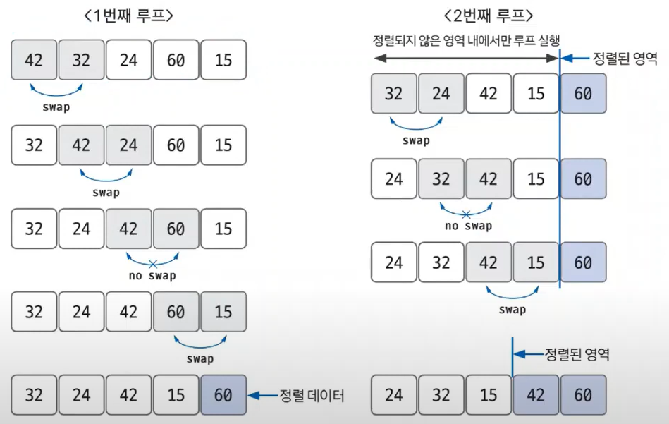
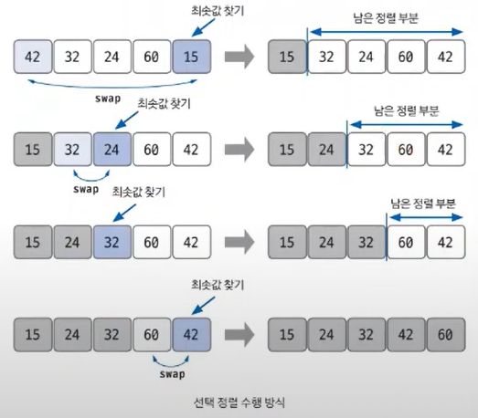
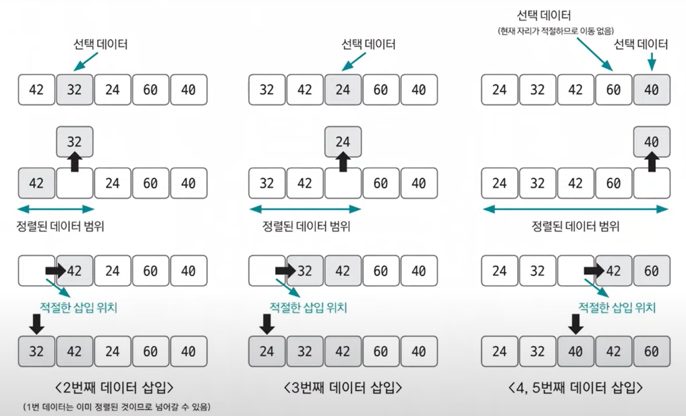

#### 📚 버블 정렬
- 데이터의 인접 요소끼리 비교하고, swap 연산을 수행하며 정렬하는 방식
- 시간 복잡도는 O(n²)으로 다른 정렬 알고리즘보다 속도가 느린 편

    
- 한 번 루프를 도는데 n번의 시간 복잡도를 갖는데 n번의 루프를 돌기 때문에 결과적으로 n²의 시간 복잡도를 갖게 되는 것!
- 특정한 루프의 전체 영역에서 swap이 한 번도 발생하지 않았다면 그 영역 뒤에 있는 데이터가 모두 정렬됐다는 뜻이므로 프로세스를 종료해도 됨 (더 이상 정렬 수행 X)

#### 📚 선택 정렬
- 어떻게 정렬하느냐에 따라 최솟값 또는 최댓값을 찾고, 남은 정렬 부분의 가장 앞에 있는 데이터와 swap하면서 정렬하는 방식
- 시간 복잡도는 O(n²)이며 구현 방법이 복잡함.

    

    > 📌 선택 정렬 과정  
    > 1. 남은 정렬 부분(정렬해야 하는 부분)에서 최솟값 또는 최댓값을 찾음.
    > 2. 남은 정렬 부분에서 가장 앞에 있는 데이터와 선택된 데이터를 swap 함.
    > 3. 가장 앞에 있는 데이터의 위치를 변경해(index++) 남은 정렬 부분의 범위를 축소함.
    > 4. 전체 데이터 크기만큼 index가 커질 때까지, 즉 남은 정렬 부분이 없을 때까지 반복함.

#### 📚 삽입 정렬
- 이미 정렬된 데이터 범위에 정렬되지 않은 데이터를 적절한 위치에 삽입시켜 정렬하는 방식
- 시간 복잡도는 O(n²)으로 느린 편이지만 구현은 쉬운 편

    

    > 📌 삽입 정렬 과정  
    > 1. 현재 index에 있는 데이터 값을 선택함.
    > 2. 현재 선택한 데이터가 정렬된 데이터 범위에 삽입될 위치를 탐색함.
    > 3. 삽입 위치부터 index에 있는 위치까지 shift 연산을 수행함.
    > 4. 삽입 위치에 현재 선택한 데이터를 삽입하고 index++ 연산을 수행함.
    > 5. 전체 데이터의 크기만큼 index가 커질 때까지, 즉 선택할 데이터가 없을 때까지 반복함.

- 적절한 삽입 위치를 탐색하는 부분에서 **이진 탐색(binary search)** 등과 같은 탐색 알고리즘을 사용하면 시간 복잡도를 줄일 수 있음.