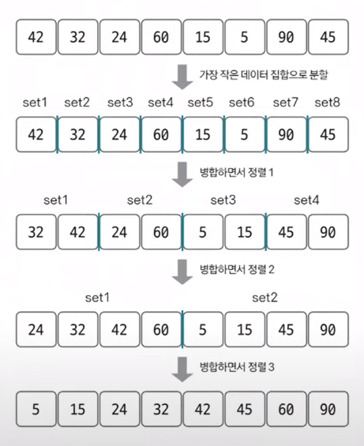
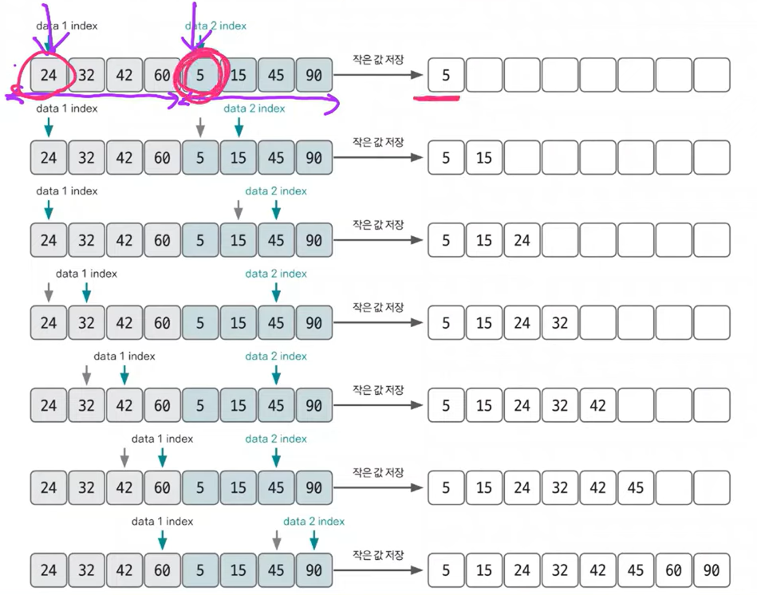

#### 📚 퀵 정렬
- 퀵 정렬은 **기준값(pivot)**을 선정해 해당 값보다 작은 데이터와 큰 데이터로 분류하는 것을 반복해 정렬하는 알고리즘
- 기준값이 어떻게 선정되는지가 시간 복잡도에 많은 영향을 미치고, 평균 시간 복잡도는 O(nlogn)이며 최악의 경우에는 시간 복잡도가 O(n²)이 됨.
- [퀵정렬 알고리즘](https://velog.io/@ywc8851/%EC%9E%90%EB%A3%8C%EA%B5%AC%EC%A1%B0-%ED%80%B5-%EC%A0%95%EB%A0%AC-Quick-Sort)

#### 📚 병합 정렬(⭐)
- 병합 정렬은 분할 정복(divide and conquer) 방식을 사용해 데이터를 분할하고 분할한 집합을 정렬하며 합치는 알고리즘
- 시간 복잡도는 O(nlogn)  

    

- 2개의 그룹을 병합하는 과정  

    
  - 투 포인터 개념을 사용하여 왼쪽, 오른쪽 그룹을 병합함.
  - 왼쪽 포인터와 오른쪽 포인터의 값을 비교하여 작은 값을 결과 배열에 추가하고 포인터를 오른쪽으로 1칸 이동시킴.