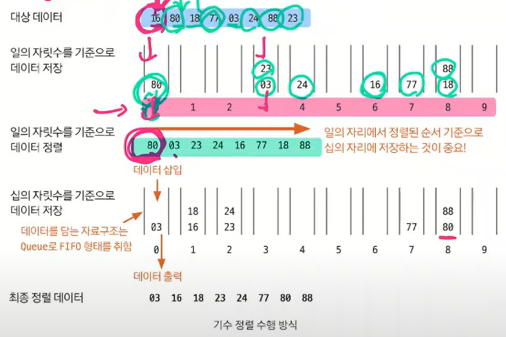

#### 📚 기수 정렬
- 기수 정렬은 값을 비교하지 않는 특이한 정렬
  - 값을 놓고 비교할 자릿수를 정한 다음 **해당 자릿수**만 비교함.
- 기수 정렬의 시간 복잡도는 O(kn), 여기서 k는 데이터의 자릿수를 말함.
- 기수 정렬은 10개의 큐를 이용함.
  - 한 자릿수에 올 수 있는 0~9까지의 수를 담기 위한 것
  - 각 큐는 값의 자릿수를 대표함.
  - 작은 자릿수부터 정렬을 하고 정렬된 데이터를 기준으로 큰 자릿수를 정렬하는 방식으로 이어짐.
  
    
    👉 위의 경우 데이터의 자릿수가 2자리 이므로 2n의 시간 복잡도를 가짐!
- 기수 정렬은 시간 복잡도가 가장 짧은 정렬  
(정렬해야 하는 데이터의 개수가 너무 많으면 기수 정렬 알고리즘 활용할 것!)

    ✨[기수 정렬 참고](https://wikidocs.net/233714)