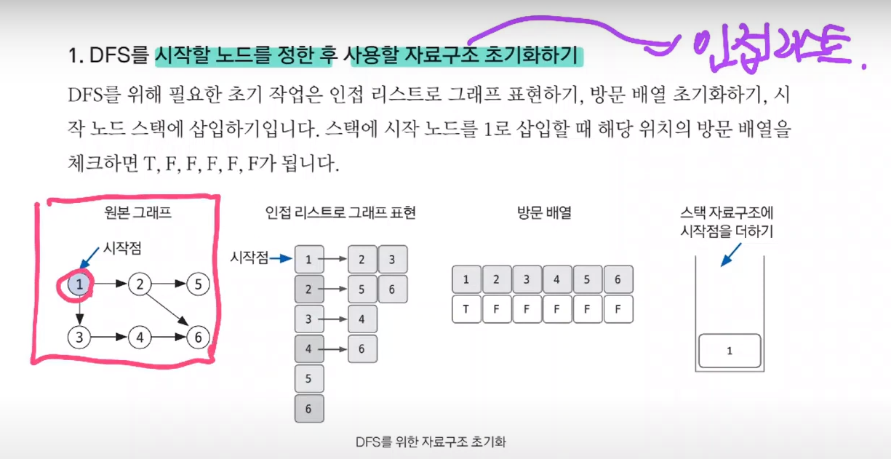
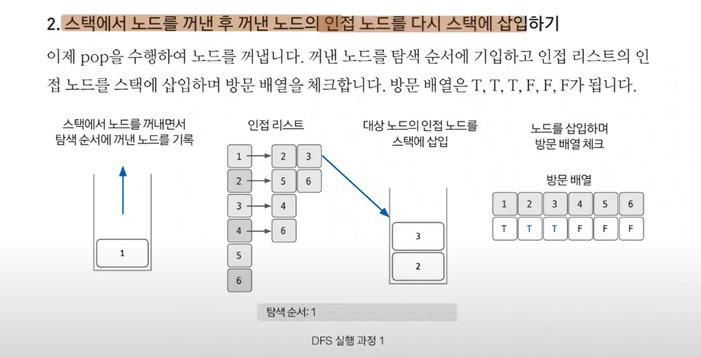
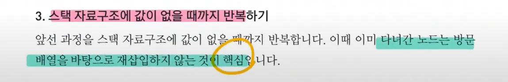
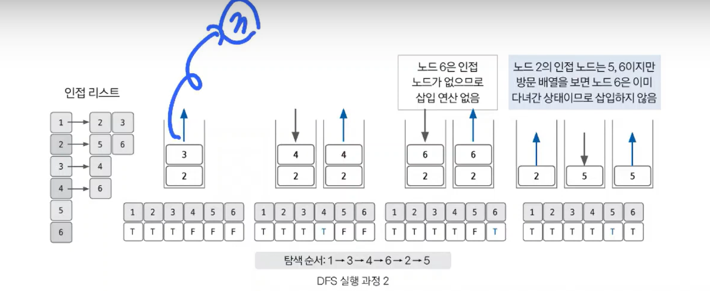
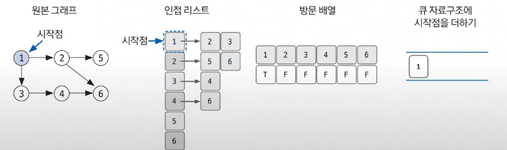
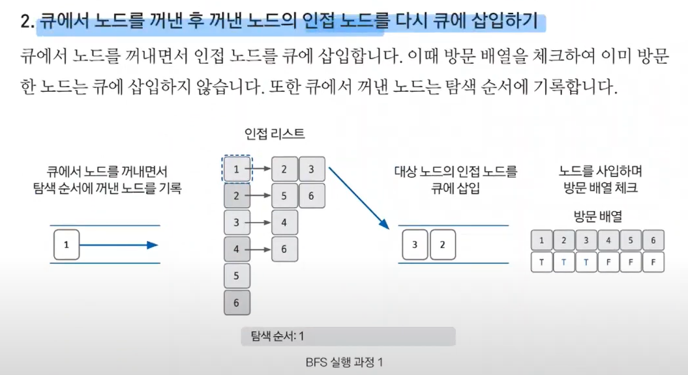
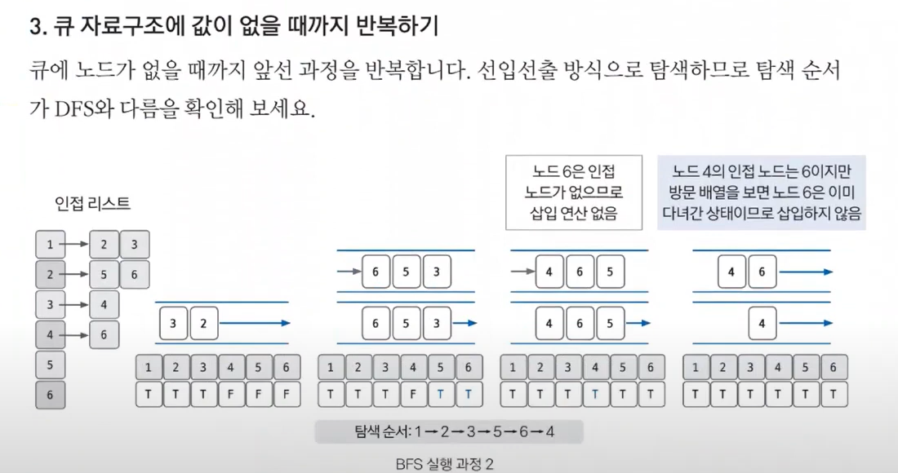

#### 📚 깊이 우선 탐색(DFS: depth-first search)  
- 그래프 완전 탐색 기법 중 하나
- 그래프의 시작 노드에서 출발하여 탐색할 한 쪽 분기를 정하여 최대 깊이까지 탐색을 마친 후 다른 쪽 분기로 이동하여 다시 탐색을 수행하는 알고리즘
- **재귀 함수** or **스택 자료구조**를 이용하여 DFS 구현 가능
- 시간 복잡도(노드 수 : V, 에지 수 : E)  
  👉 O(V + E)
- 깊이 우선 탐색은 실제 구현 시 재귀함수를 이용하므로 스택 오버플로(stack overflow)에 유의해야 함.
- 응용하여 풀 수 있는 문제는 그래프 완전 탐색, 단절점 찾기, 단절선 찾기, 사이클 찾기, 위상 정렬 등이 있음.  

> 📌 DFS의 핵심이론  
> - DFS는 한번 방문한 노드를 다시 방문하면 안되므로 노드 방문 여부를 체크할 배열이 필요하며, 그래프는 인접 리스트로 표현
> - DFS의 탐색 방식은 **후입선출(LIFO)** 특성을 가지므로 스택을 사용하여 구현 가능하지만 주로 재귀 함수로 많이 함.  

  
  

  
👉 스택에 노드를 삽입할 때 방문 배열을 체크하고, 스택에서 노드를 뺄 때 탐색 순서에 기록하며 인접 노드를 방문 배열과 대조하여 살펴봄!

#### 📚 너비 우선 탐색(BFS : breadth-first search)  
- 그래프를 완전 탐색하는 방법 중 하나
- 시작 노드에서 출발해 시작 노드를 기준으로 **가까운 노드를 먼저 방문하면서 탐색하는 알고리즘**  
- **선입선출(FIFO)** 방식으로 탐색하므로 큐를 이용해 구현
- 시간 복잡도(노드 수 : V, 에지 수 : E)  
  👉 O(V + E)  
- BFS는 탐색 시작 노드와 가까운 노드를 우선하여 탐색하므로 목표 노드에 도착하는 경로가 여러 개일 때 최단 경로를 보장함.

> 📌 BFS의 핵심이론   
> - DFS와 마찬가지로 방문했던 노드는 다시 방문하지 않으므로 방문한 노드를 체크하기 위한 배열 필요  
> - 그래프를 인접 리스트로 표현
> - 탐색을 위해 큐를 사용함!  
>        
>  
> 👉 1. BFS를 위한 자료구조 초기화  
> 
>   
>   

#### 📚 이진 탐색(binary search)  
- **데이터가 정렬돼 있는 상태**에서 원하는 값을 찾아내는 알고리즘
- 대상 데이터의 중앙값과 찾고자 하는 값을 비교해 데이터의 크기를 절반씩 줄이면서 대상을 찾는 방식
- 시간 복잡도 O(logN)
- 원하는 데이터를 탐색할 때 사용하는 가장 일반적인 알고리즘  

> 📌 이진탐색 핵심이론  
> : 이진탐색은 오름차순으로 정렬된 데이터에서 다음 4가지 과정을 반복함.  
> 1. 현재 데이터셋의 중앙값(median)을 선택함.
> 2. 중앙값 > 타깃 데이터일 때 중앙값 기준으로 왼쪽 데이터셋을 선택함.
> 3. 중앙값 < 타깃 데이터일 대 중앙값 기준으로 오른쪽 데이터셋을 선택함.
> 4. 과정 1~3을 반복하다가 중앙값 == 타깃 데이터일 때 탐색 종료  

#### 📚 그리디 알고리즘(greedy algorithm)  
- 현재 상태에서 보는 선택지 중 최선의 선택지가 전체 선택지 중 최선의 선택지라고 가정하는 알고리즘  

> 📌 그리디 알고리즘의 핵심이론  
> : 그리디 알고리즘은 다음과 같은 3단계를 반복하면서 문제를 해결함.
> 1. 해 선택: 현재 상태에서 가장 최선이라고 생각되는 해를 선택함.
> 2. 적절성 검사: 현재 선택한 해가 전체 문제의 제약 조건에 벗어나지 않는지 검사함.
> 3. 해 검사: 현재까지 선택한 해 집합이 전체 문제를 해결할 수 있는지 검사함. 전체 문제를 해결하지 못한다면 1.로 돌아가 같은 과정을 반복함.