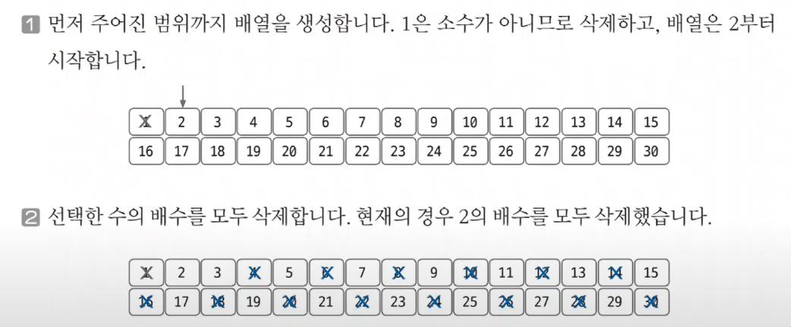
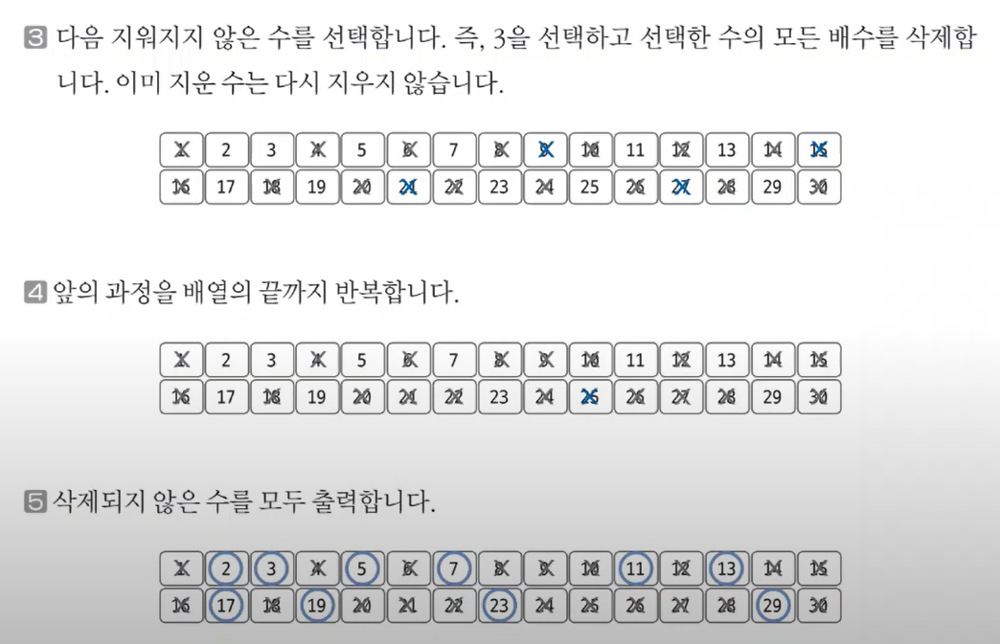
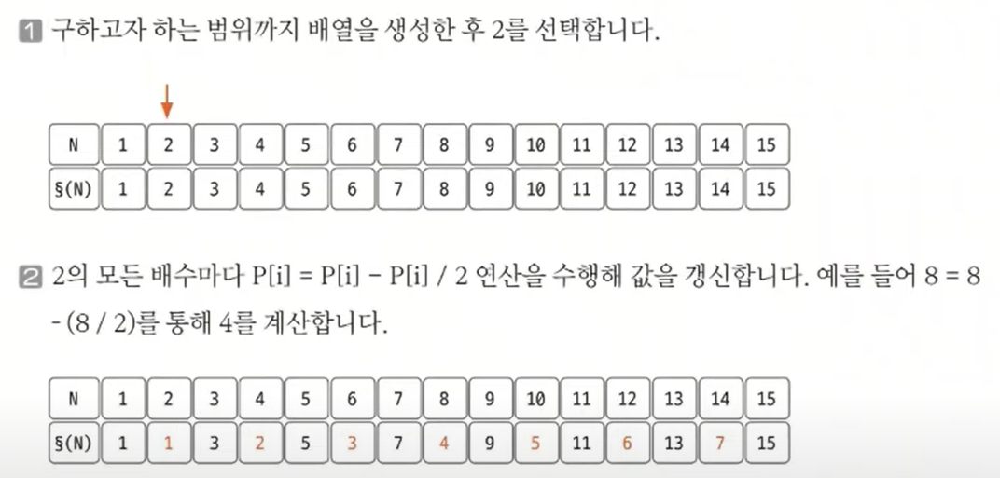
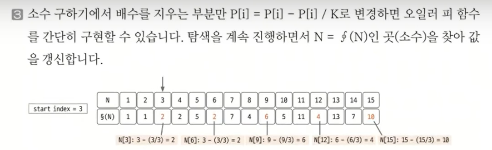
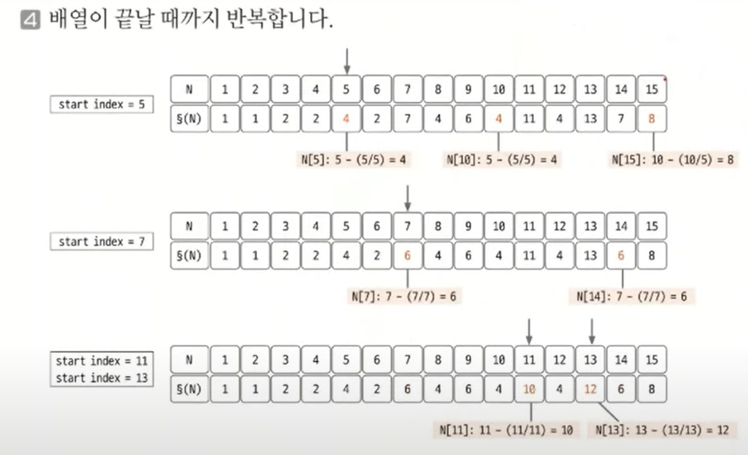

#### 📚 소수 구하기  
- 소수 : 1과 자기 자신 외에 약수가 존재하지 않는 수    

📌 소수 구하기의 핵심 이론    
- 소수를 구하는 대표적인 판별법으로는 에라토스테네스의 체를 들 수 있음.  
> 📜 에라토스테네스의 체 원리  
> 1. 구하고자 하는 소수의 범위만큼 1차원 배열을 생성함.
> 2. 2부터 시작하고 현재 숫자가 지워지지 않을 때는 현재 선택된 숫자의 배수에 해당하는 수를 배열에서 끝까지 탐색하면서 지움.  
👉 이때 처음으로 선택된 숫자는 지우지 않음! (이 수가 소수이기 때문)  
> 3. 배열의 끝까지 2️⃣를 반복한 후 배열에서 남아 있는 모든 수를 출력함.  

- 예시) 1부터 30까지의 수 중 소수 구하기  
  
    
    

#### 📚 오일러의 피  
- 오일러 피 함수 P[N]의 정의는 1부터 N까지 범위에서 N과 서로소인 자연수의 개수를 뜻함.  
👉 서로소 : 공약수가 1이외에 없는 것  
> ex) P[6] = 2  
> 1 ~ 6 범위에서 6과 서로소인 자연수의 개수 => 1과 5로 2️⃣ 개!  

📌 오일러 피의 핵심 이론  
1. 구하고자 하는 오일러 피의 범위만큼 배열을 **자기 자신의 인덱스 값**으로 초기화함.  
2. 2부터 시작해 현재 배열의 값과 인덱스가 같으면(=소수일 때) 현재 선택된 숫자(K)의 배수에 해당하는 수를 배열에 끝까지 탐색하며 **P[i] = P[i] - P[i]/K 연산**을 수행함 (i는 K의 배수)  
3. 배열의 끝까지 2️⃣를 반복하여 오일러 피 함수를 완성함.  

      
    
    